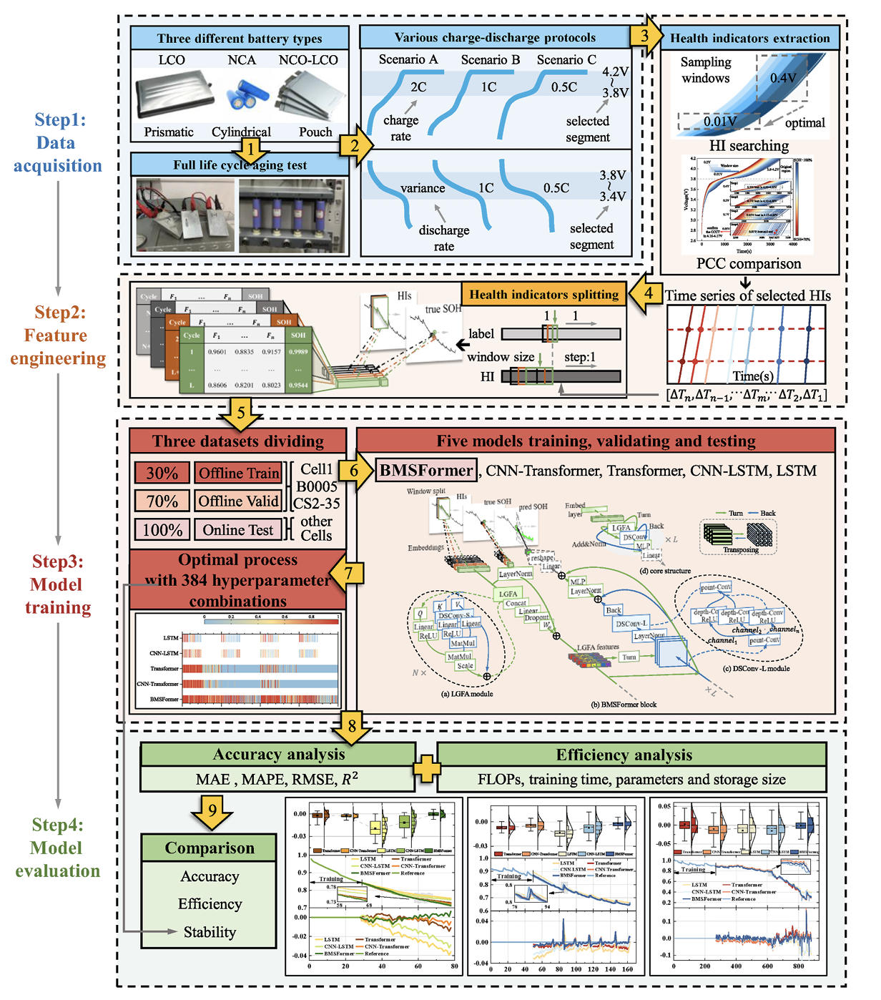
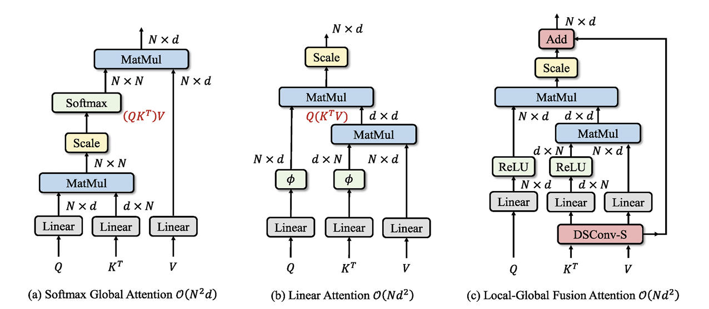
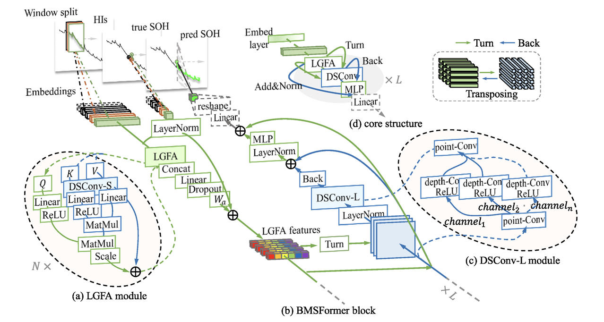
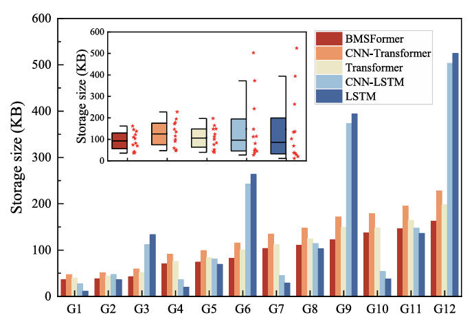

  
  
  
  
  
  
  
  <h1>📚 Reading Notes: BMSFormer - An Efficient SOH Estimation Model for Resource-Constrained BMS</h1>
  
Paper: BMSFormer: An efficient deep learning model for online state-of-health estimation of lithium-ion batteries under high-frequency early SOC data with strong correlated single health indicator

  
  

    <a href="./" style="padding: 5px 10px; background: #f0f0f0; border-radius: 4px; text-decoration: none; color: #333;">简体中文</a> | 
    <a href="#readme" style="padding: 5px 10px; background: #333; border-radius: 4px; text-decoration: none; color: #fff; font-weight: bold;">English</a> | 
    <a href="README_es.html" style="padding: 5px 10px; background: #f0f0f0; border-radius: 4px; text-decoration: none; color: #333;">Español</a> | 
    <a href="README_pt.html" style="padding: 5px 10px; background: #f0f0f0; border-radius: 4px; text-decoration: none; color: #333;">Português</a>
  

> **Paper Title**: BMSFormer: An efficient deep learning model for online state-of-health estimation...  
> **Journal**: Energy (2024, Vol.313, 134030)  
> **Core Model**: BMSFormer (Local-Global Fusion Attention + Depthwise Separable Convolution)  
> **Key Advantage**: Maintains SOTA prediction accuracy while significantly reducing computational complexity (Linear Complexity).

## 🔍 Core Problems
Current Lithium-ion battery SOH estimation faces a dilemma between "Accuracy" and "Efficiency":
- **Traditional Light Models** (e.g., LSTM, SVM): Low computational cost but insufficient accuracy for nonlinear, unstable data.
- **Modern Deep Models** (e.g., Transformers, CNNs): High accuracy but rely on resource-heavy structures, making them difficult to deploy on resource-constrained Battery Management Systems (BMS).
- **The Softmax Bottleneck**: Traditional Transformer self-attention has a computational complexity of $O(N^2)$, which is extremely slow for long sequence data.

## 💡 Innovative Solution: BMSFormer
The paper proposes a lightweight, high-efficiency deep learning model named **BMSFormer**. The overall workflow includes: High-frequency segment data acquisition -> Feature engineering (HI extraction) -> Model training -> Evaluation.

> 📊 **Overview of BMSFormer Methodology**
> 
> *This figure illustrates the complete loop from Data Acquisition (Step 1), Feature Engineering (Step 2), Model Training (Step 3), to Evaluation (Step 4). The core involves extracting highly correlated Health Indicators (HIs) from high-frequency charge/discharge segments.*

### Core Technical Modules
1.  **LGFA Module (Local-Global Fusion Attention)**:
    -   **Innovation**: Replaces traditional Softmax Attention with ReLU-based Linear Attention.
    -   **Effect**: Reduces computational complexity from $O(N^2)$ to $O(N)$, significantly speeding up long-sequence processing.
    -   **Fusion**: Integrates the DSConv-S module to enhance sensitivity to local features, addressing the insufficient expressiveness of linear attention models.

> 📊 **Comparison of Attention Mechanisms**
> 
> *The comparison shows (a) Traditional Softmax Global Attention, (b) Linear Attention, and (c) The proposed LGFA module. LGFA achieves linear complexity fusion of local and global features by introducing DSConv-S.*

2.  **Multi-scale Depthwise Separable Convolution (DSConv)**:
    -   Designed **DSConv-S** (small kernel) and **DSConv-L** (large kernel) modules.
    -   Significantly reduces parameters and FLOPs compared to standard convolution while capturing multi-scale and multi-channel features.

> 📊 **BMSFormer Architecture**
> 
> *Detailed illustration of the BMSFormer structure, including the LGFA module, DSConv-L module, and the stacking of blocks.*

## 📈 Experiments & Results
The paper validated the model on three major public datasets: **Oxford**, **NASA**, and **CALCE**.

- **Accuracy Improvement**: Compared to CNN-Transformer, LSTM, etc., BMSFormer performs best in RMSE, MAE, and MAPE metrics, with stronger tracking ability for sudden data changes.
- **Impressive Efficiency**:
    -   Training time reduced by approximately **21.37%**.
    -   Extremely low and stable storage footprint, ideal for embedded deployment.

> 📊 **Model Storage Size Comparison**
> 
> *This figure shows that under various hyperparameter combinations, BMSFormer (Red) consistently maintains the lowest and most stable storage size compared to CNN-Transformer, LSTM, and others.*

## 📚 References
- **Citation**: X. Li, M. Zhao, S. Zhong, et al. BMSFormer: An efficient deep learning model for online state-of-health estimation of lithium-ion batteries under high-frequency early SOC data with strong correlated single health indicator[J]. Energy, 2024, 313: 134030.
- **Data Sources**: Oxford Battery Dataset, NASA Prognostics Repository, CALCE Battery Group.
- **Paper PDF**: <a href="pdf/BMSFormer_Lee2_pure.pdf" style="color: #0078d4; text-decoration: none; font-weight: 500;">📄 BMSFormer_Lee2_pure.pdf</a> (Click to view/download)

 

  
© 2026 Tech Blog Notes | Source: <a href="https://doi.org/10.1016/j.energy.2024.134030">Elsevier Energy</a>

   
  <a href="./">简体中文</a> | 
  <a href="#readme">English</a> | 
  <a href="README_es.html">Español</a> | 
  <a href="README_pt.html">Português</a>

